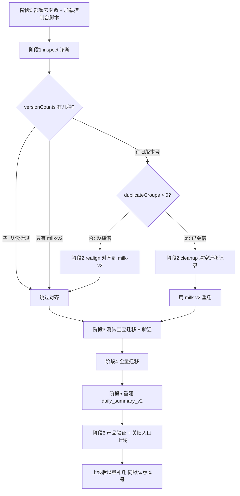

# 奶粉 v2 上线完整执行流程

本文档是奶粉 v2 模块上线的端到端操作手册，覆盖**旧版本号处理 → 数据迁移 → 删除临时工具页 → 审核发布 → 发布前/后增量 → 汇总重建 → 回滚**全流程。

- 适用环境：微信小程序云开发（`prod-7g5lap9xcf106dbf`），历史全量迁移主路径使用**本地开发者工具里的临时迁移工具页**执行，无需任何腾讯云密钥。
- 命令行（node）路径见 [`milk-v2-migration-runbook.md`](./milk-v2-migration-runbook.md)，逻辑一致。
- 迁移采用「复制到 v2 集合、不改旧集合」策略，旧 `feeding_records` 全程不动，可随时回退。

---

## 当前待发布状态的实施清单

> 适用于：代码已审核通过、待发布，但当前本地仍有 `pages/milk-migration-tool/index` 临时迁移工具页。**如果审核通过的版本包含这个工具页，不要发布该版本。**

### 0. 代码与云函数准备

1. 确认三个云函数都已部署到生产环境：
   - `migrateNutritionProfiles`
   - `migrateFeedingRecordsV2`（必须是包含 `inspect` / `realignVersion` / `cleanupMigrated` 的新版）
   - `backfillGrowthRecordsV2`
2. 保留本地临时工具页，仅用于开发者工具执行全量迁移：
   - `miniprogram/pages/milk-migration-tool/`
   - `app.json` 中的 `pages/milk-migration-tool/index`
3. 不要发布包含临时工具页的审核包。

### 1. 发布前：先做全量历史清洗

用微信开发者工具添加编译模式，启动页面填：

```text
pages/milk-migration-tool/index
```

进入页面后，`babyUid` 输入框留空（表示全部宝宝、全部历史），按顺序执行：

1. 点 **诊断现状**
   - `duplicateGroups` 必须为 `0`
   - `versionCounts` 只允许是 `milk-v2`，或旧版本号已先完成对齐
2. 点 **全量预览(dry-run)**
   - 重点看喂奶迁移 `errors` 必须为 `0`
   - `warnings` 需要人工确认，特别是缺普奶/特奶档案
3. 点 **全量迁移(执行)**
   - 自动执行：配奶档案 → 喂奶记录 v2 → 成长回填
   - 自动循环 `nextOffset`，不用手动改 offset
   - 之前测试 baby 已迁过的 `milk-v2` 记录会走 `existingSkipped`，不会重复
4. 执行完成后再次点 **诊断现状**
   - `versionCounts` 应只剩 `milk-v2`
   - `duplicateGroups` 必须为 `0`
   - `migrationTotal` 应大于原测试 baby 的 2001 条

记录这次全量迁移完成日期，例如 `FULL_MIGRATION_DATE = 2026-06-07`。后续发布前/后的增量都从这天开始。

### 2. 全量清洗后：删除临时工具页并重新提审

全量历史清洗完成后，删除临时工具页代码：

```text
删除目录：miniprogram/pages/milk-migration-tool/
删除 app.json pages 中的：pages/milk-migration-tool/index
```

然后重新上传代码、重新提交审核。审核期间线上仍是旧版本，用户继续写入旧 `feeding_records`，这些数据不会丢，只是还没补迁到 v2。

### 3. 审核通过后：发布前最后增量

审核通过后，**先不要点发布**。在云开发控制台对 `migrateFeedingRecordsV2` 做一次发布前增量补迁，补齐「全量清洗完成 → 审核通过」期间旧版本新增的喂奶。

云函数测试 event：

```json
{
  "dryRun": false,
  "migrationVersion": "milk-v2",
  "startDate": "FULL_MIGRATION_DATE",
  "pageSize": 50,
  "maxBatches": 20,
  "offset": 0
}
```

执行规则：

- 必须带 `"migrationVersion": "milk-v2"`。
- `startDate` 替换为阶段 1 记录的全量迁移完成日期。
- 如果返回 `hasMore: true`，把下一次 event 的 `offset` 改成返回的 `nextOffset`，继续调用。
- 直到返回 `hasMore: false` 且 `errors: []`。

发布前最后增量完成后，再点小程序发布。

### 4. 发布后：过渡期增量

小程序发布后，新旧版本会并存一段时间：未更新用户仍可能继续用旧入口写入 `feeding_records`。发布后继续用同一个 event 补增量：

```json
{
  "dryRun": false,
  "migrationVersion": "milk-v2",
  "startDate": "FULL_MIGRATION_DATE",
  "pageSize": 50,
  "maxBatches": 20,
  "offset": 0
}
```

建议节奏：

- 发布后立即
- 当晚或第二天
- 3 天后
- 7 天后

连续几次 `migrated: 0`，说明旧入口基本不再新增，可以收尾。

### 5. 汇总校验与重建

全量迁移和增量补迁后，抽查首页趋势、数据记录页、分析页。若历史奶量/蛋白汇总不准，需要让受影响日期的 `daily_summary_v2` 失效并重建：

- 轻量：打开首页/数据记录页，让页面按 `rebuildMissing: true` 懒重建近 7~30 天。
- 稳妥：按宝宝和日期范围把 `daily_summary_v2` 标记 `isDirty:true` 或删除缓存后逐日重建。

---

## 名词与幂等键

- 三个迁移云函数：
  - `migrateNutritionProfiles`：旧配奶设置 → `milk_nutrition_profiles`
  - `migrateFeedingRecordsV2`：旧 `feeding_records.feedings[]` → `feeding_records_v2`
  - `backfillGrowthRecordsV2`：旧身高体重 → `growth_records_v2`
- **喂奶迁移幂等键** = `babyUid + legacyRecordId + legacyFeedingIndex + migrationVersion`。
- `migrationVersion` 默认固定为 `milk-v2`（不随日期变化）。**同版本号重跑安全、不会重复**；换版本号 = 整段历史再插一份（会翻倍）。
- 配奶档案按 `babyUid` upsert、成长回填按 `babyUid + date` 补空字段，二者**不依赖** `migrationVersion`，重跑天然幂等。

---

## 总览决策图



---

## 阶段 0 · 准备

1. **重新部署 `migrateFeedingRecordsV2`**：本次新增 `inspect` / `realignVersion` / `cleanupMigrated` 三个维护模式，必须重新上传部署。确认 `migrateNutritionProfiles`、`backfillGrowthRecordsV2` 也已部署。
2. 用微信开发者工具打开项目，确认右上角选中的是目标云环境 `prod-7g5lap9xcf106dbf`。
3. 打开「调试器 / Console」，把 `scripts/milk-v2-migration-wx-console.js` 全文复制粘贴回车（只定义函数，不写库）。

加载成功后 Console 可用这些函数：

| 函数 | 作用 | 默认行为 |
|------|------|----------|
| `inspectMilkV2Migration()` | 只读诊断迁移现状 | 只读 |
| `realignMilkV2Version()` | 旧版本号统一改成 `milk-v2` | dry-run |
| `cleanupMilkV2Version()` | 删除 `source:'legacy_migration'` 迁移记录 | dry-run |
| `runMilkV2Migration()` | 配奶 → 喂奶 → 成长 三步迁移 | dry-run |

---

## 阶段 1 · 诊断（决定走哪条路）

```js
inspectMilkV2Migration()
```

重点看三个字段：

| 字段 | 含义 | 判断 |
|------|------|------|
| `versionCounts` | 各 `migrationVersion` 的条数 | 历史用了哪个/哪些版本号 |
| `duplicateGroups` | 同一 `legacyRecordId+legacyFeedingIndex` 重复组数 | `0` = 没翻倍；`>0` = 已翻倍 |
| `nonMigrationTotal` | 用户在 v2 入口新建的真实记录数 | 对齐/清理**不会**动它们 |

诊断函数会根据结果直接打印建议。

---

## 阶段 2 · 处理旧版本号（按诊断分支）

> 只有「之前已经迁移过、且版本号不是 `milk-v2`」才需要本阶段。否则跳到阶段 3。

### 分支 ①：从没迁过 / 已是 `milk-v2` 单版本

`versionCounts` 为空，或只有 `milk-v2` 且 `duplicateGroups = 0` → **跳过本阶段**。

### 分支 ②：有旧版本号、`duplicateGroups = 0`（最常见）→ 对齐

把旧版本号统一改成 `milk-v2`，之后用默认值增量即可幂等。

```js
realignMilkV2Version()                   // ① dry-run 预览，看 matched 条数
realignMilkV2Version({ execute: true })   // ② 正式对齐
```

- 只想改特定版本号：`realignMilkV2Version({ execute: true, fromVersions: ['milk-v2-migration'] })`
- 对齐会给每条加 `versionRealignedFrom`，便于追溯/回滚。
- 对齐后**再 `inspectMilkV2Migration()` 复核**：应只剩 `milk-v2` 一种版本号。

### 分支 ③：`duplicateGroups > 0`（已翻倍）或多版本混乱 → 清空重迁

只删迁移记录（`source:'legacy_migration'`），不碰用户新建记录：

```js
cleanupMilkV2Version()                    // ① dry-run 预览，看 matched 条数
cleanupMilkV2Version({ execute: true })    // ② 正式删除
```

删完进入阶段 3，用默认 `milk-v2` 重迁。

---

## 阶段 3 · 测试宝宝迁移 + 验证

先拿一个测试宝宝跑全流程（脚本内部按 配奶档案 → 喂奶 → 成长 顺序执行）：

```js
runMilkV2Migration({ babyUid: '测试宝宝babyUid' })                 // ① dry-run
runMilkV2Migration({ babyUid: '测试宝宝babyUid', execute: true })   // ② 正式
```

**dry-run 验收**：

- `feeding.errors` 必须为空（有 error 不能正式迁移）。
- `feeding.warnings` 人工过一遍，尤其 `missing_milk_nutrition_profile`、`empty_formula_components`、缺普奶/特奶档案的告警。
- 出现缺档案告警，先去 `milk_nutrition_profiles` 补齐对应奶粉再迁，否则这部分奶量不会迁移。

**正式后抽查 `feeding_records_v2`**：

- `source: "legacy_migration"`、`migrationVersion: "milk-v2"`
- `date` 是 `YYYY-MM-DD` 字符串（不是云数据库 Date 类型）
- `formulaComponents` 普奶/特奶组件合理

**页面核对**：打开配奶管理 v2、喂奶编辑器 v2、首页/数据记录 v2，核对几天数字与旧页是否一致。

---

## 阶段 4 · 全量迁移

测试宝宝无误后，去掉 `babyUid` 跑全量：

```js
runMilkV2Migration()                  // ① 全量 dry-run，errors 必须为 0
runMilkV2Migration({ execute: true })  // ② 全量正式
```

- 历史数据大就分片：加 `startDate` / `endDate`，或调小 `pageSize: 5`。
- 脚本自动循环 `nextOffset` 到 `hasMore:false`，单批 `maxBatches:1`，避免云函数超时。
- 已迁记录会被判重跳过（`existingSkipped`），重跑安全。

---

## 阶段 5 · 重建 daily_summary_v2

迁移 / 对齐后喂奶事实源变了，必须让相关日期的汇总失效并重建，否则趋势 / 汇总仍是旧快照。

- **轻量（近 7~30 天）**：打开首页 / 数据记录页，其 `getDailySummariesForRange(..., { rebuildMissing: true })` 会按需重建缺失或过期（`isDirty`）的天。
- **稳妥（全历史）**：对每个宝宝，从首条喂奶日期到今天，把 `daily_summary_v2` 设 `isDirty:true`（或删该范围缓存）后逐日重建。

重建事实源应为：`feeding_records_v2`、`food_intake_records`（或过渡期旧 `feeding_records.intakes`）、`growth_records_v2`、`medication_records`、`treatment_records`、`bowel_records`。参考工作区规则 `daily-summary-v2-food-cleanup`。

---

## 阶段 6 · 上线 + 上线后增量

1. 产品验证通过后，**隐藏 / 下线旧喂奶入口**，新记录只写 `feeding_records_v2`。
2. 迁移窗口内若仍有人用旧入口写过喂奶，用**同一默认版本号**补增量（幂等，不会重复）：

```js
runMilkV2Migration({ step: 'feeding', execute: true })
```

3. 补完再重建一次受影响日期的汇总（阶段 5）。
4. 观察 1~2 天：`warnings`、用户反馈、分析页 v2 营养是否符合预期。

---

## 回滚预案

- 旧 `feeding_records` 全程不修改、不删除，v2 出问题就隐藏 v2 入口、回退旧页。
- 撤销某次迁移（只删迁移记录，不碰用户新建记录和旧表）：

```js
cleanupMilkV2Version({ execute: true, migrationVersions: ['milk-v2'] })
```

- 配奶档案、成长回填只写 v2 集合，旧集合不受影响。

---

## 附录 A · 控制台函数 options 速查

| 函数 | 关键 options |
|------|--------------|
| `inspectMilkV2Migration` | `babyUid`、`toVersion` |
| `realignMilkV2Version` | `execute`、`babyUid`、`toVersion`(默认 `milk-v2`)、`fromVersions`、`pageSize`、`maxBatches` |
| `cleanupMilkV2Version` | `execute`、`babyUid`、`migrationVersions`、`pageSize`、`maxBatches` |
| `runMilkV2Migration` | `execute`、`step`(`all`/`profiles`/`feeding`/`growth`/`repair-dates`)、`babyUid`、`migrationVersion`(默认 `milk-v2`)、`pageSize`、`maxBatches`、`delayMs`、`startDate`、`endDate`、`includeBabyInfoInitial`、`powderVersionRules`、`continueOnErrors` |

所有写操作默认 dry-run，必须显式 `execute: true` 才写库。

## 附录 B · 关键执行顺序

```text
部署 → 加载脚本
  → inspect
  → (有旧版本号) realign 或 cleanup
  → 测试宝宝 dry-run → execute → 验证
  → 全量 dry-run → execute
  → 重建 daily_summary_v2
  → 关旧入口上线
  → (窗口内有旧入口写入) step:feeding 增量 → 再重建汇总
```

## 附录 C · 风险清单

- 正式迁移前 `errors` 必须为空。
- 换 `migrationVersion` 前必须确认旧版本号已对齐或清理，否则喂奶记录翻倍、汇总双计。
- 缺普奶 / 特奶档案的告警必须先补档案再迁，否则丢失对应奶量（迁移记录带 `migrationDroppedComponents`）。
- 迁移 / 对齐 / 清理后务必重建受影响日期的 `daily_summary_v2`。
- 不要并发对同一 `babyUid` 同时跑迁移，幂等靠查询判重而非唯一索引。
